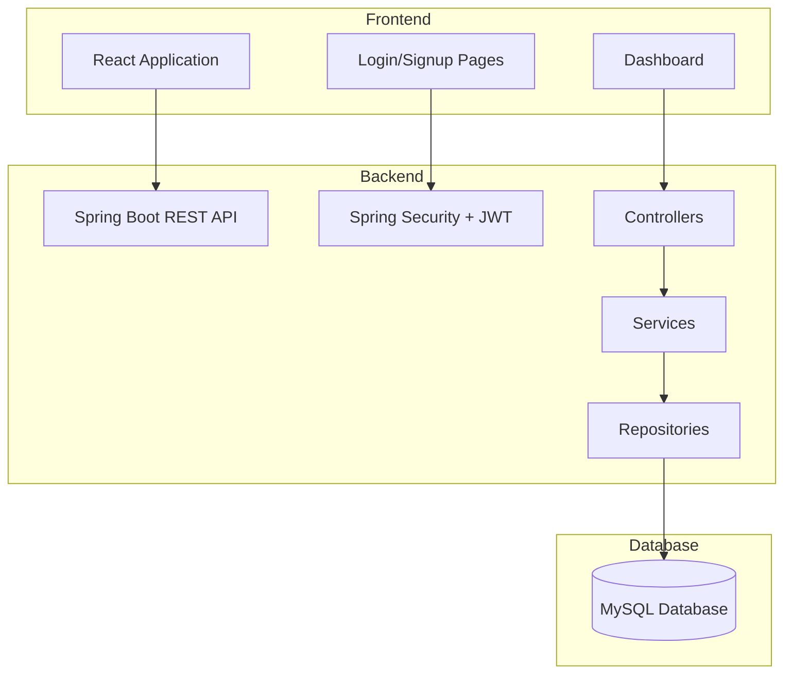
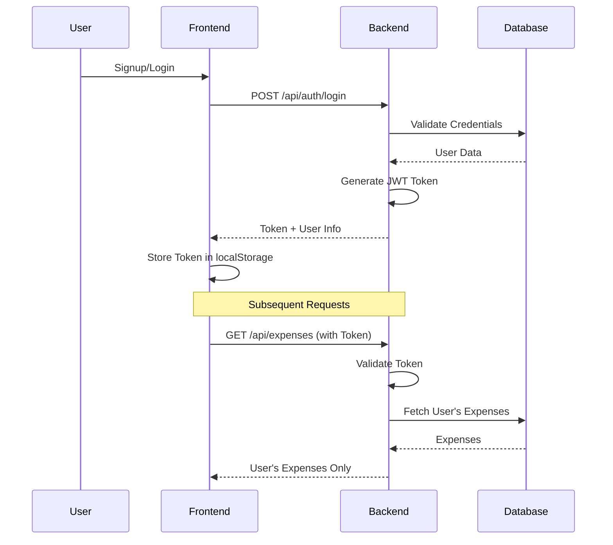
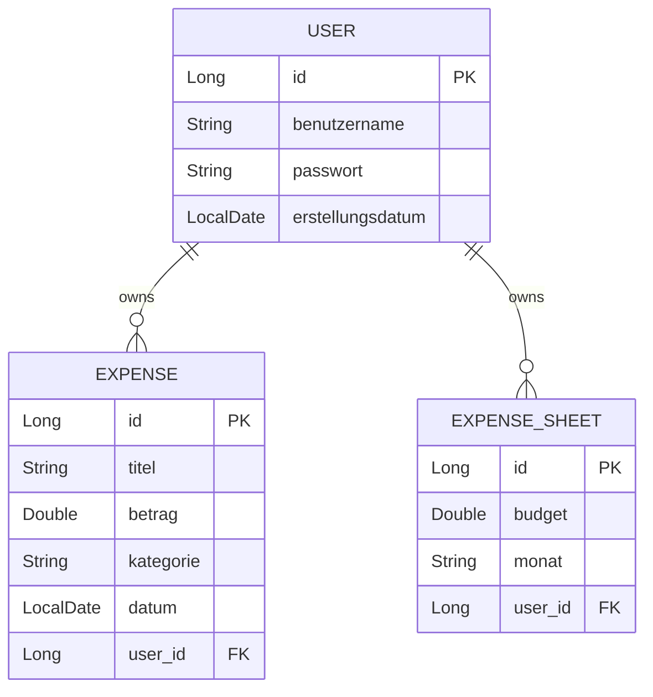
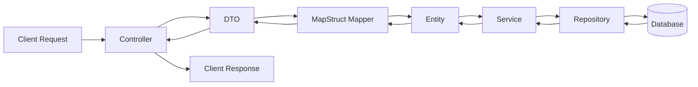
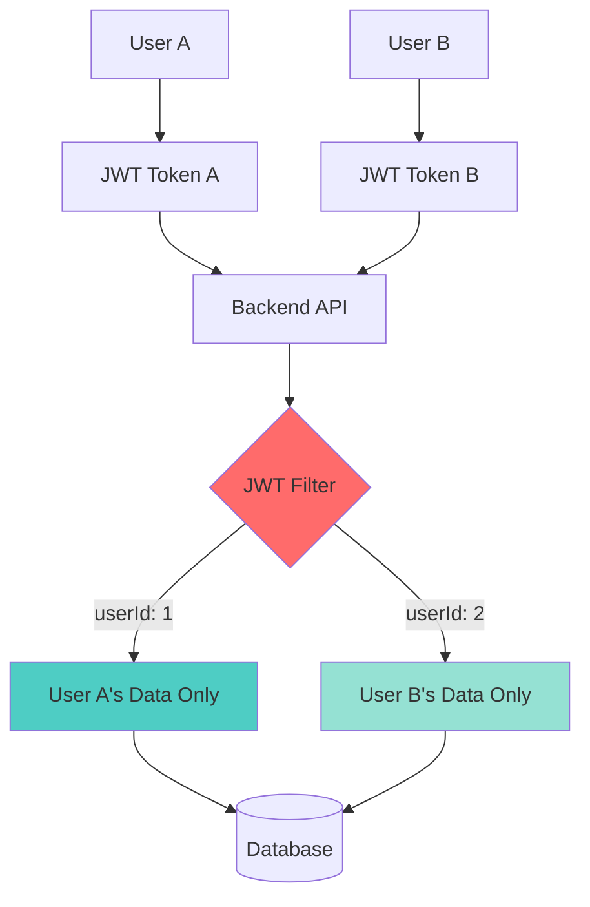

# Expense Tracker - Multi-User Architektur

## System-Übersicht



## Multi-User Authentication Flow



## Datenbank-Schema (Multi-User)



## Backend-Architektur (DTO Pattern)



## API Endpoints

```mermaid
graph TD
    API[Spring Boot API]
    
    API --> Auth[/api/auth]
    Auth --> Login[POST /login]
    Auth --> Signup[POST /signup]
    
    API --> Users[/api/users]
    Users --> GetUsers[GET /]
    Users --> CreateUser[POST /]
    
    API --> Expenses[/api/users/:userId/expenses]
    Expenses --> GetExpenses[GET /]
    Expenses --> CreateExpense[POST /]
    Expenses --> UpdateExpense[PUT /:id]
    
    API --> Sheets[/api/expense-sheets]
    Sheets --> GetSheets[GET /]
    Sheets --> CreateSheet[POST /]
    
    style Auth fill:#90EE90
    style Login fill:#FFD700
    style Signup fill:#FFD700
```

## User Isolation (Multi-User Feature)


